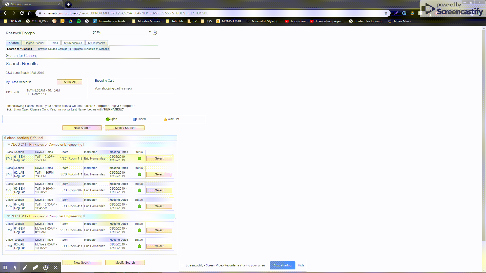

# CSULB_Professor_Ratings_Bookmarklet
Finds the names of professors on a page, and replaces them with a link to their rate my professor as well as a corresponding score

# How to use it
1) Paste the code in URL as a bookmark
2) Click it on a page with professor names

